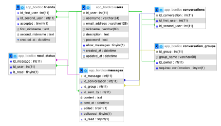

# Bordico - Komunikator tekstowy .NET MAUI

## Krzysztof Smaga, nr. 21815

### Programowanie równoległe, 08.06.2025

#### Opis projektu

Bordico jest to aplikacja mobilna służąca do komunikacji tekstowej między użytkownikami. Aplikacja wykorzystuje połączenie z serwerem, który obsługuje każdą interakcje, jaką użytkownik wykona. Aplikacja wymaga bycia zalogowanym.
Aplikacja została zbudowana przy użyciu:

- Frontend: .NET MAUI (iOS/Android/Desktop)
- Backend: ASP.NET Core Web API
- Baza danych: MariaDB
- OR/M: Entity Framework Core
- Komunikacja: REST API
- Autoryzacja: JWT

Konstrukcja bazy danych, na której opiera się aplikacja:

#### Funkcjonalność, opis

##### Rejestracja

Użytkownik może założyć konto, podając login, hasło i inne podstawowe dane (np. email, nazwa użytkownika). Dane są walidowane po stronie klienta i serwera. Hasło jest hashowane i bezpiecznie przechowywane w bazie danych (MariaDB). Rejestracja odbywa się przez wywołanie endpointu REST API (POST /Api/Auth/Register).

##### Logowanie

Użytkownik loguje się przy użyciu loginu i hasła. Backend weryfikuje dane i zwraca token JWT, który służy do autoryzacji wszystkich kolejnych żądań. Token jest przechowywany lokalnie w aplikacji MAUI i dołączany do nagłówków HTTP (Authorization: Bearer <token>).

##### Tworzenie i zarządzanie konwersacjami

Użytkownik może rozpocząć nową konwersację z jednym znajomym. Tworzenie konwersacji odbywa się poprzez wywołanie odpowiedniego endpointu API (POST /Api/Messages/CreateConversation). Lista konwersacji jest synchronizowana z backendem i wyświetlana w aplikacji.

##### Wysyłanie i odbieranie wiadomości

W każdej konwersacji użytkownik może wysyłać wiadomości tekstowe. Backend zapisuje wiadomości w bazie danych z odniesieniem do użytkownika i konwersacji. Aplikacja wyświetla historię wiadomości w czasie rzeczywistym lub cyklicznie odświeżając dane (w zależności od implementacji). Do komunikacji w czasie rzeczywistym wykorzystuje rozszerzenie SignalR.

##### Zarządzanie znajomymi

Użytkownicy mogą wyszukiwać innych użytkowników i dodawać ich do listy znajomych. Możliwe jest akceptowanie lub odrzucanie zaproszeń. System zarządza relacjami między użytkownikami – np. Friends, FriendRequests.

##### Bezpieczeństwo i autoryzacja

Każde żądanie do backendu wymaga autoryzacji tokenem JWT. Backend weryfikuje tożsamość użytkownika na podstawie tokena. Dostęp do danych jest ograniczony – użytkownik może np. odczytać tylko swoje konwersacje.
